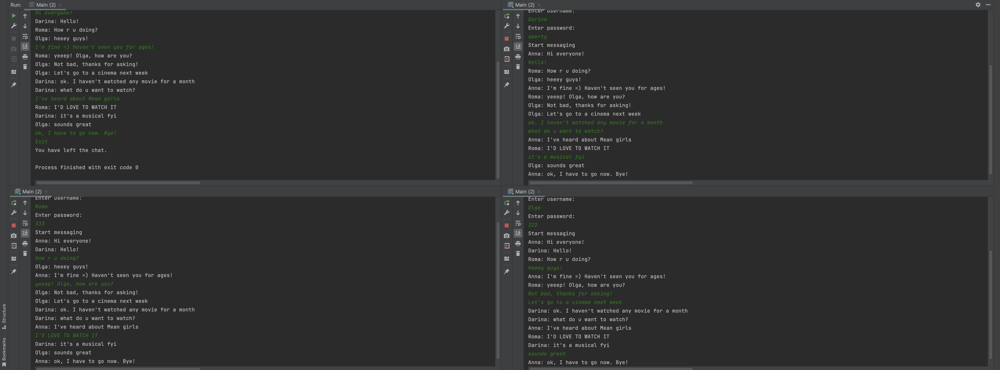

# MultiUserChat

## Цель проекта
Написать консольное приложение - многопользовательский чат для изучения базового механизма клиент-серверного взаимодействия на Java - Sockets API, а также для практики работы с потоками и базой данных.

## Примененные технологии

* Java 18
* Spring Security
* Spring JdbcTemplate
* HikariCP
* Maven
* Postgresql.

## Результат
Изучены основы Sockets API и реализовано многопоточное клиент-серверное консольное приложение, с сохранением данных в базе данных PostgreSQL.

### Функционал приложения

* Регистрация пользователей;
* Вход пользователей (проверяются данные для авторизации, при этом пароли хранятся в базе данных в зашифрованном виде);
* Отправка сообщения (каждый пользователь, подключенный к серверу, получает данное сообщение);
* Выход.

### Пример работы приложения

